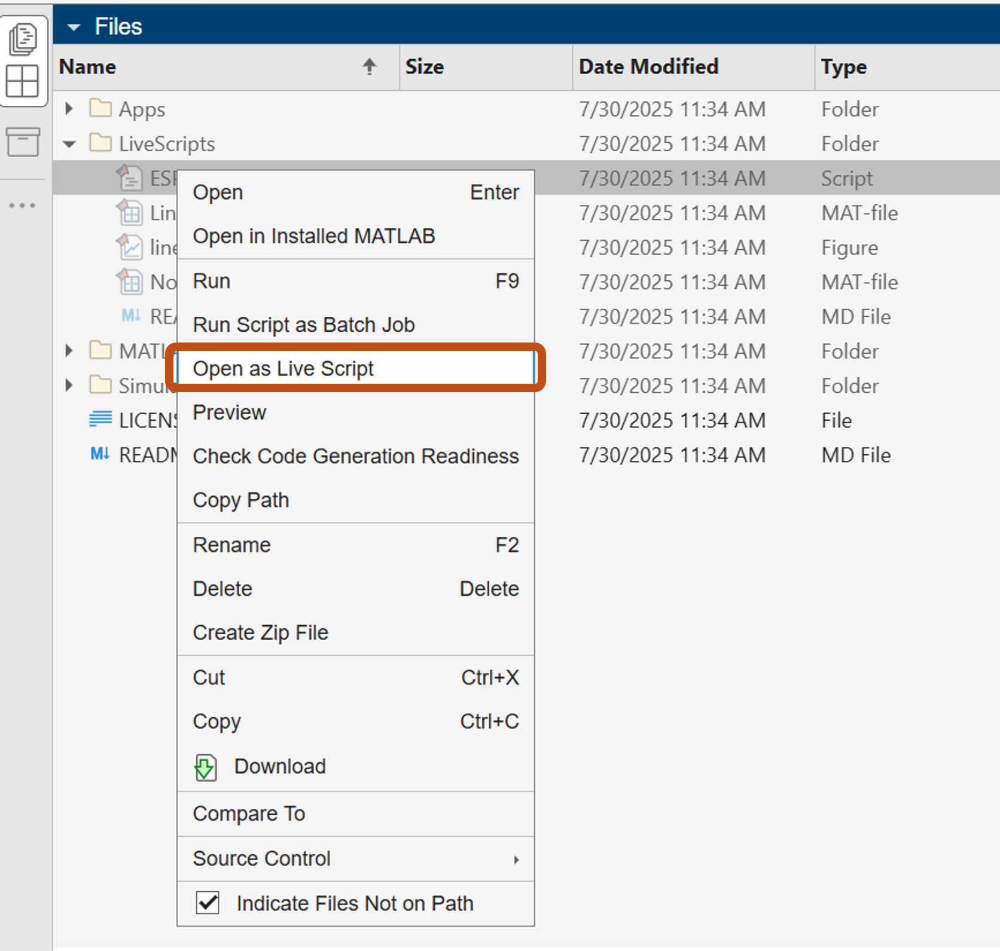

# Live scripts

Para esta actividad utilizaremos una sección del material didáctico [Regression Basics](https://la.mathworks.com/matlabcentral/fileexchange/93435-regression-basics) traducido, en formato *.m*.
Empezaremos con un script .m llamado [ESP_RegressionBasics.m](https://matlab.mathworks.com/open/github/v1?repo=gabyarellano/MaterialesTallerEducadores&file=ESP_RegressionBasics.m) que convertiremos en live script.
### 1. Abriremos el archivo como un live script 
Para ello, en la sección *Files*, haremos clic izquierdo en ESP_RegressionBasics.m y seleccionaremos "Open as a Live Script".

### 2. Esto nos abrirá un nuevo archivo. Podemos ver que:

- MATLAB identificó algunos comentarios como texto e incluso títulos.
- MATLAB identificó algunas de las ecuaciones escritas en LaTeX y las representa visualmente.

### 3. Hacer modificaciones necesarias y guardar el archivo.

### 4. Explorar el archivo y conversar acerca de:
- Dónde se podría agregar más interactividad, imágenes, ecuaciones, hipervínculos, etc. para mejorar el material.
- ¿En qué circunstancias tiene sentido ocultar o no ocultar el código?
- Imprimir resultados en la ventana de comandos vs. otras opciones como no suprimir el resultado del código (es decir, no escribir *;* al final de la línea de código)
- Compartir otros live scripts que hayan creado.
- Retos/ideas para el uso de live scripts.
- Podemos abrir archivos de Simulink desde MATLAB usando [open_system](https://la.mathworks.com/help/simulink/slref/open_system.html)

### Otros recursos:

- [Live scripts compartidos en FileExchange](https://la.mathworks.com/matlabcentral/fileexchange?utf8=%E2%9C%93&term=%22live+script%22)
- [Material didáctico](https://la.mathworks.com/academia/courseware.html)
- [Live scripts for Online Teaching](https://youtu.be/mICYVEwe6Jg?si=6JEffJlwdREMxCjV)

#
**Para navegar a las demás herramientas:**

| **Herramienta**                      | **Instrucciones** |
|----------------------------------|-------------|
| Livescripts                      | [Accede aquí](https://github.com/gabyarellano/MaterialesTallerEducadores/tree/master/LiveScripts) | |
| Apps                             | [Accede aquí](https://github.com/gabyarellano/MaterialesTallerEducadores/tree/master/Apps)|
| MATLAB Grader                    | [Accede aquí](https://github.com/gabyarellano/MaterialesTallerEducadores/tree/master/MATLAB%20Grader)|
| Simulación con Simulink/Simscape | [Accede aquí](https://github.com/gabyarellano/MaterialesTallerEducadores/tree/master/Simulacion) |
